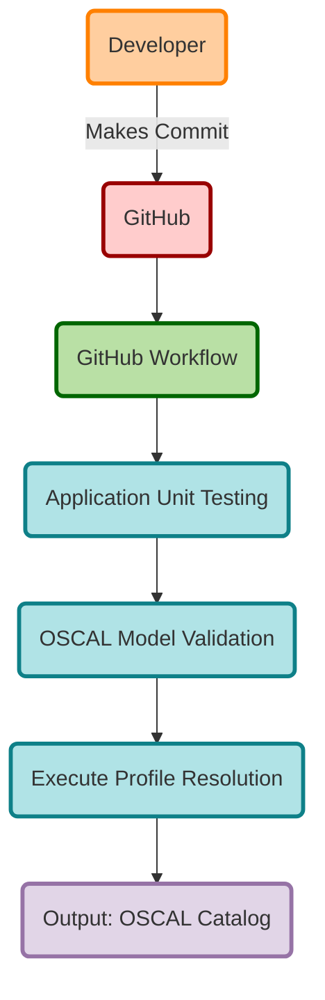

# Case Study Usage Instructions and Overview

## Usage

## Project Structure

## Implemented Workflow

```mermaid
    graph TD
        A(Developer) -->|Makes Commit| B(GitHub)
        B --> C(GitHub Workflow)
        C --> D(Application Unit Testing)
        D --> E(OSCAL Model Validation)
        E --> F(Execute Profile Resolution)
        F --> G(Output: OSCAL Catalog)
    
    classDef step fill:#FFCE9F,stroke:#FF8000,stroke-width:3px;
    classDef execution fill:#FFCCCC,stroke:#990000,stroke-width:3px;
    classDef file fill:#B0E3E6,stroke:#0E8088,stroke-width:3px;
    classDef output fill:#B9E0A5,stroke:#006600,stroke-width:3px;
    classDef highlight fill:#E1D5E7,stroke:#9673A6,stroke-width:3px;

    class A step
    class B execution
    class C output
    class D file
    class E file
    class F file
    class G highlight
```

## Feedback and Contributions

## Misc Diagrams Placeholders (To Be Update to current state)

