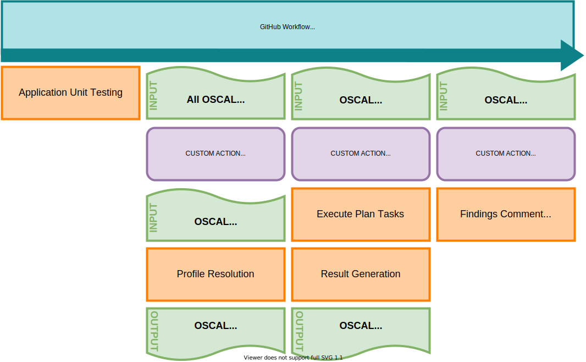
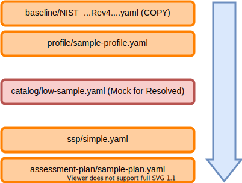
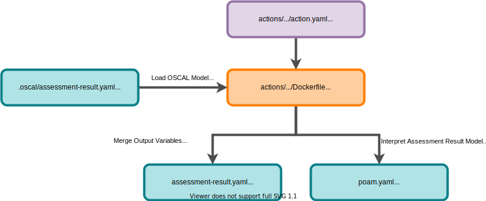
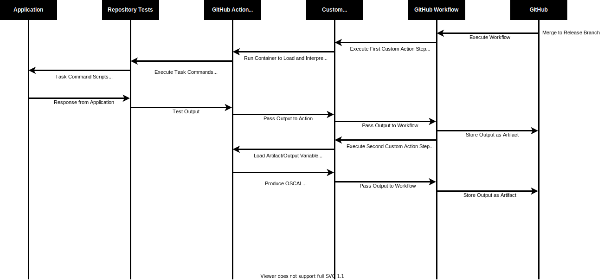

# Case Study Usage Instructions and Overview

## Usage

## Project Structure

### .github/

This directory contains the overall CI workflow for GitHub Actions, as well as the custom GitHub Actions to interpret OSCAL content.

### app/

This directory contains the target application to be tested and assessed.  This would typically be the application being developed.

### tests/

This directory contains test that would be a part of the standard unit/regression tests for the application being developed.

### cypress/

This directory contains user acceptance tests, which could also include testing of controls.  Cypress can produce evidence through screenshots and videos to demonstrate more complex use case scenarios for one or more controls.

### .oscal/

This directory contains OSCAL model files.

### assessments/

This directory contains security control test script that are executed as a part of the assessment action in the workflow.

## Implemented Workflow

## Feedback and Contributions

## Misc Diagrams Placeholders (To Be Update to current state)

